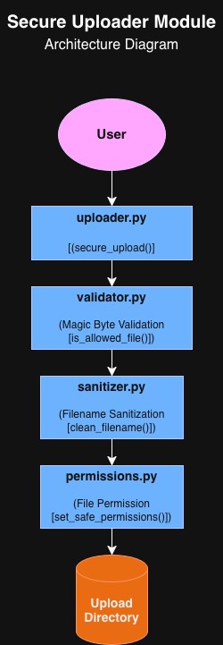

# Lunarch Secure Uploader

---

## Overview

This project was developed as part of an internship to demonstrate secure file upload practices using Python.

---

## Description

Lunarch Secure Uploader is a Python-based security module designed to improve the safety of file uploads in web applications. The project validates uploaded files, sanitizes filenames, prevents path traversal attacks, and applies safe file permissions before storing uploaded files.

---

## Project Status

Completed (v1.0)

---

## Features

- Magic byte file validation
- Filename sanitization
- Path traversal prevention
- Safe file permission management
- Secure upload workflow
- Modular architecture
- Edge-case testing

---

## Project Structure

```text
secure_uploader/
│
├── validator.py
├── sanitizer.py
├── permissions.py
├── uploader.py
│
├── tests/
├── uploads/
├── docs/
└── README.md
```

---

## Architecture



---

## Requirements

- Python 3.9 or later
- No external libraries required
- Compatible with Windows, Linux, and macOS

---

## Security Workflow

1. Validate the uploaded file using magic byte signatures.
2. Sanitize the filename.
3. Generate a safe upload path.
4. Copy the file into the upload directory.
5. Apply safe file permissions.

---

## Installation

Clone the repository:

```bash
git clone https://github.com/SudeNazDilbaz/Lunarch-InternshipProj.git
```

Navigate to the project directory:

```bash
cd Lunarch-InternshipProj
```

No external libraries are required. The project uses only the Python Standard Library.

---

## Example Usage

Use the `secure_upload()` function to securely upload a file.

```python
from secure_uploader.uploader import secure_upload

result = secure_upload(
    "tests/sample_files/sample.jpg",
    "my photo.jpg",
    "uploads"
)

print(result)
```
The module validates the uploaded file, sanitizes the filename, generates a safe upload path, copies the file into the upload directory, and applies safe file permissions.

---

## Documentation

Additional project documentation is available in the `docs` directory.

---

## Future Improvements

- Support additional file formats
- Add logging support
- Create a Flask/Django integration example
- Implement automated unit testing with pytest